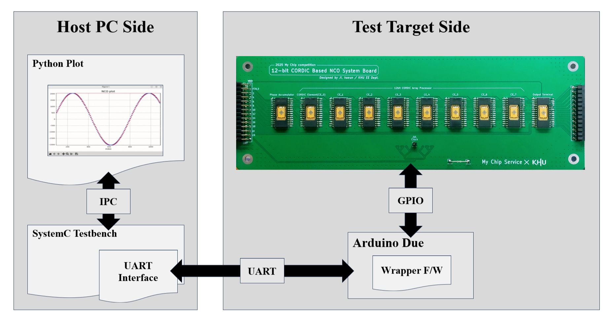
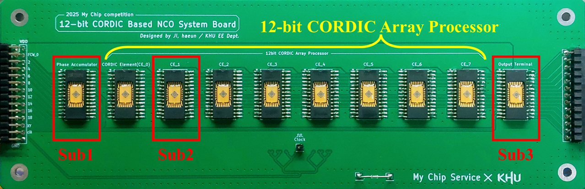

# My Chip Service 25y1st: **12-bit CORDIC-based NCO**

## Notice: What is **My Chip Service**?
An initiative in South Korea that provides MPW (Multi-Project Wafer) services using public fabrication facilities (fabs) for undergraduate and graduate students.
* **Official Website:** [https://www.moafab.kr](https://www.moafab.kr/css/myPage/bussiness/myChip/info)
* **Design Kit (Open-Source):** [ETRI 0.5um CMOS MPW Standard Cell DK](https://github.com/GoodKook/ETRI-0.5um-CMOS-MPW-Std-Cell-DK/tree/main)

---

## Project: 12-bit CORDIC-based NCO

### 1. Overview

*Fig 1. System Architecture*


*Fig 2. NCO implemented on a PCB using 'My Chip'*

* **Description:** A **Numerically Controlled Oscillator (NCO)** is a digital circuit that generates synchronous, discrete-time, discrete-valued representations of sinusoidal waveforms. This project implements an NCO using a **CORDIC (Coordinate Rotation Digital Computer)** array processor to calculate trigonometric values. The complete verification environment and system structure are illustrated in **Fig 1**.

* **Key Challenges: Overcoming Physical Constraints**
    * **Core Limits:** Since the NCO design exceeded the single-chip area limit, it was **partitioned into three sub-circuits** as shown in **Fig 2**:
        1. **Phase Accumulator:** Generates the phase angle.
        2. **CORDIC Processing Element:** Performs the vector rotation.
        3. **Output Terminal:** Manages the final data output, including quadrant restoration.
    * **Pad Limits:** Each chip is limited to **28 pins**. the I/O for each sub-circuit was implemented using a **2-bit serial interface**.

---

### 2. Directory Structure
```text
├── 0_Algorithm (Algorithm development, including output plots and verification)
│   ├── c_untimed: C-based NCO algorithm
│   ├── cpp_untimed: C++ based NCO algorithm
│   └── sc_timed: SystemC-based NCO model (Clock-event-based cycle-accurate design)
|
├── 1_Parallel_IO (Reference design using parallel I/O (Not implemented in this version))
|
├── 2_Splited_IO (RTL-to-GDS with Open-Source Design Kit, including output plots and verification)
│   ├── 2_0_Top_NCO: Integrated NCO system comprising all three sub-circuits
│   ├── 2_1_Phase_Acc: Sub-circuit 1
│   ├── 2_2_Cordic_Element: Sub-circuit 2
│   ├── 2_3_Output_Terminal: Sub-circuit 3
|
└── 3_Application (application cases)
    ├── 3_0_Generate_Sinusoid: Sinusoidal waveform generation
    ├── 3_1_QPSK_Communication_prototype: QPSK simulation for the prototype board
    └── 3_2_QPSK_Communication_pcb: QPSK simulation for the final PCB
